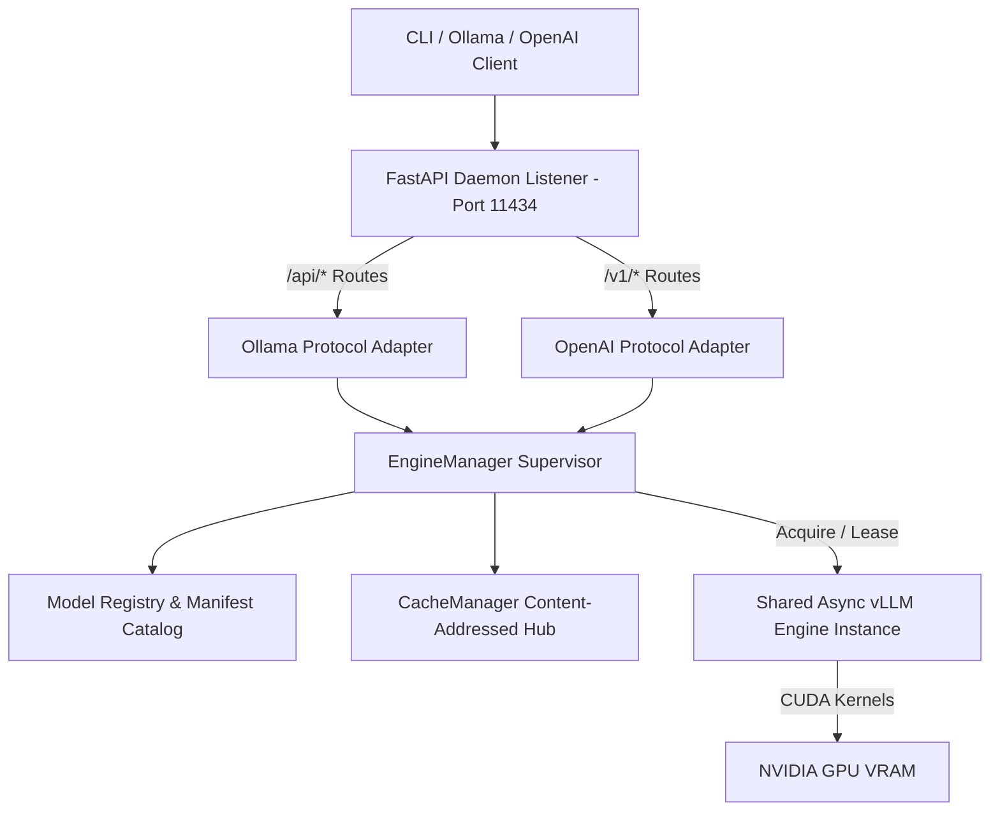

# Architectural Execution Plan: Clean-Room Ollama-Compatible LLM Runtime via vLLM and TurboQuant

## Primary Source Citations & References
*   **Ollama Official Documentation & Specifications**:
    *   [Ollama API Reference](https://docs.ollama.com/api/introduction)
    *   [Ollama CLI Command Reference](https://docs.ollama.com/cli)
    *   [Ollama Modelfile Specifications](https://docs.ollama.com/modelfile)
    *   [Ollama FAQ: Model Loading and Keep-Alive Semantics](https://github.com/ollama/ollama/blob/main/docs/faq.md#how-do-i-keep-a-model-loaded-in-memory-or-change-how-long-it-stays-loaded)
*   **vLLM Official Documentation & Upstream Source**:
    *   [vLLM v0.22.1 Release Notes](https://github.com/vllm-project/vllm/releases/tag/v0.22.1)
    *   [vLLM TurboQuant Quantization Layer API Docs (v0.22.1)](https://docs.vllm.ai/en/v0.22.1/api/vllm/model_executor/layers/quantization/turboquant/)
    *   [vLLM TurboQuant Configuration Source Code (`vllm/model_executor/layers/quantization/turboquant/config.py`)](https://github.com/vllm-project/vllm/blob/v0.22.1/vllm/model_executor/layers/quantization/turboquant/config.py)
    *   [vLLM Attention Backends Architecture (v0.22.1)](https://docs.vllm.ai/en/v0.22.1/design/attention_backends/)
    *   [vLLM GPU Installation & Platform Requirements (v0.22.1)](https://docs.vllm.ai/en/v0.22.1/getting_started/installation/gpu/)

---

## 1. Purpose & User-Visible End State

This document establishes the technical blueprint and file-by-file refactoring specification to transform **ForgeAI** into a clean-room, **Ollama-compatible**, single-engine local LLM service powered exclusively by **vLLM (v0.22.1)**.

### 1.1 Core Vision & End-State Goals
1.  **Exclusive vLLM Backend**: Elimination of `llama.cpp`, `llama-cpp-python`, `.gguf` file discovery, CPU-only inference, and dual-backend auto-selection. ForgeAI supports Hugging Face vLLM-compatible repositories and local vLLM-compatible safetensors directories; GGUF (`.gguf`) and raw pickled PyTorch (`.bin`/`.pt`) inputs are unsupported.
2.  **Clean-Room Ollama Parity**:
    *   **CLI Subcommands**: `serve`, `pull`, `run`, `ls`, `ps`, `show`, `rm`, `stop`, `create`.
    *   **REST Endpoints**: `/api/generate`, `/api/chat`, `/api/embed`, `/api/tags`, `/api/ps`, `/api/show`, `/api/pull`, `/api/delete`, `/api/version`.
    *   **Default Listener**: Binds to `127.0.0.1:11434` by default (overridable via `FORGEAI_HOST` and `FORGEAI_PORT`).
    *   **NDJSON Response Streaming**: Standardized newline-delimited JSON response streams clean-room behaviorally compatible where marked supported (`model`, `created_at`, `response`/`message`, `done`, `total_duration`, `load_duration`, `prompt_eval_count`, `eval_count`).
    *   **`keep_alive` Semantics**: Omitted/null defaults to 5 minutes (`5m`); numeric seconds or duration strings set TTL; `0` forces immediate unload after request drain; negative values mean indefinite warm memory.
3.  **Preserved OpenAI REST Compatibility**: Serves `/v1/chat/completions`, `/v1/models`, and `/v1/models/{model_id}` on the same daemon listener (`127.0.0.1:11434`).
4.  **Native TurboQuant KV-Cache Quantization**: Integrates native vLLM TurboQuant KV-cache compression presets (`turboquant_k8v4`, `turboquant_4bit_nc`) to reduce memory footprint by 2.6x to 3.8x on supported NVIDIA CUDA hardware.
5.  **Linux/WSL2 Engine Runtime**: Runs on Linux host environments or Windows WSL2 / Linux Docker containers. CPU fallbacks are explicitly unsupported.

---

## 2. Current-State Inventory & Removal Analysis

**Inspected Baseline Commit**: `c4171634b2e3e883a13887de1204d4e4b6a11b07`

### 2.1 Repository-Wide Inventory of Affected Files (25 Files)

| Target File Path | Current Role / References | Planned Refactoring Action |
| :--- | :--- | :--- |
| `README.md` | Dual-backend docs, `llama.cpp` flags, `.gguf` auto-detection. | Rewrite for vLLM-exclusive deployment, YAML manifests, and TurboQuant options. |
| `Dockerfile` | Multi-stage build with `ARG BACKEND=llamacpp` and `llama-cpp-python` compilation. | Simplify to single vLLM (`vllm==0.22.1`) build based on official vLLM images. |
| `pyproject.toml` | Declares `llamacpp` optional dependencies and project keywords (`gguf`, `llama-cpp`). | Strip `llamacpp` extra and keywords. Pin `vllm==0.22.1` in `gpu`, `vllm`, and `all` extras. |
| `SECURITY.md` | Security policy mentioning GGUF model scanning exceptions. | Update policy: GGUF models are strictly rejected at admission. |
| `src/forgeai/cli/main.py` | Top-level Typer application entrypoint with legacy backend flags. | Update CLI registration to include Ollama subcommands (`ls`, `ps`, `stop`, `create`, `rm`). |
| `src/forgeai/cli/commands/batch.py` | Batch processing command with `--backend llama_cpp` and GGUF discovery. | Remove llama.cpp options and GGUF fallback logic; use vLLM engine. |
| `src/forgeai/cli/commands/benchmark.py` | Performance benchmarking script targeting dual backends. | Refactor to benchmark vLLM KV-cache profiles (BF16, FP8, TurboQuant). |
| `src/forgeai/cli/commands/chat.py` | Interactive terminal chat CLI supporting llama.cpp. | Re-wire to stream from shared local `EngineManager` via vLLM async runtime. |
| `src/forgeai/cli/commands/doctor.py` | Diagnostics checking `llama-cpp-python` and CPU capabilities. | Remove llama-cpp checks; verify CUDA CC >= 7.5, driver versions, and WSL2 environment. |
| `src/forgeai/cli/commands/run.py` | Single-shot prompt CLI with `--n-gpu-layers` and `--n-ctx`. | Remove deprecated flags. Route to `EngineManager` with manifest validation. |
| `src/forgeai/cli/commands/serve.py` | Starts FastAPI daemon with backend selection parameters. | Strip backend flags. Support `--host`, `--port` (default 11434), and `--keep-alive`. |
| `src/forgeai/core/backends/__init__.py` | Exports backend classes (`LlamaCppBackend`, `VLLMBackend`). | Export only `VLLMBackend` and base interfaces. |
| `src/forgeai/core/backends/base.py` | Abstract base class `BaseBackend` for engine wrappers. | Keep base contract clean; simplify for vLLM streaming capabilities. |
| `src/forgeai/core/backends/factory.py` | `resolve_backend` logic routing `.gguf` to `LlamaCppBackend`. | Remove resolution logic; factory returns `VLLMBackend` exclusively. |
| `src/forgeai/core/backends/llamacpp_backend.py` | Wrapper around `llama-cpp-python` library. | **DELETE FILE ENTIRELY**. |
| `src/forgeai/core/backends/vllm_backend.py` | Implementation of `VLLMBackend`. | Inject `--kv-cache-dtype` support, manifest parameter translation, and CC checks. |
| `src/forgeai/core/config.py` | Contains `DevToolSettings` with `n_gpu_layers`, `n_ctx`, `n_batch`, `BackendType`. | Remove llama.cpp settings and enums. Add `KVCacheSettings` and `TurboQuantConfig`. |
| `src/forgeai/core/engine.py` | Single-engine `DevToolEngine` wrapper. | Deprecate. Introduce multi-model `EngineManager` with refcounts and keep_alive timers. |
| `src/forgeai/core/telemetry.py` | Telemetry tracker recording backend type metrics. | Remove `llama_cpp` telemetry labels. |
| `src/forgeai/models/gguf_finder.py` | HF Hub search helper finding GGUF quantized models. | **DELETE FILE ENTIRELY**. |
| `src/forgeai/models/quantization.py` | Quantization enums including GGUF quantization types (`Q4_K_M`, etc.). | Strip GGUF quantization enum variants. Retain `awq`, `gptq`, `fp8`, `bitsandbytes`. |
| `src/forgeai/models/safety_scanner.py` | Weight safety scanner with GGUF file parsing logic. | Remove GGUF binary header scanning; focus on safetensors and config metadata inspection. |
| `src/forgeai/utils/memory_estimator.py` | Memory calculator for GGUF layer offloading to VRAM. | Remove llama.cpp layer estimation logic; use vLLM VRAM profiling calculations. |
| `tests/test_api_compliance.py` | Tests verifying GGUF Jinja fallback templates and llama.cpp. | Delete llama.cpp tests. Add tests for Ollama `/api/*` REST endpoints. |
| `tests/test_architecture_patches.py` | Tests asserting `LlamaCppBackend` async generation. | Strip `LlamaCppBackend` assertions; update for `EngineManager`. |
| `tests/test_run.py` | CLI tests checking `--backend llama_cpp` parameter parsing. | Replace with tests for Ollama CLI commands and error handling for deprecated flags. |

### 2.2 Architectural Subsystem Inventory (All Components)
*   **API Layer**:
    *   `src/forgeai/api/server.py`: Mount both `/api/*` (Ollama) and `/v1/*` (OpenAI) routers on single FastAPI app listening on port 11434.
    *   `src/forgeai/api/routes/__init__.py`: Package init exporting all route blueprints.
    *   `src/forgeai/api/routes/ollama.py` *(New)*: Handlers for Ollama endpoints (`generate`, `chat`, `embed`, `tags`, `ps`, `show`, `pull`, `delete`, `version`).
    *   `src/forgeai/api/routes/chat.py`: Refactor `/v1/chat/completions` to use `EngineManager`.
    *   `src/forgeai/api/routes/models.py`: Refactor `/v1/models` and `/v1/models/{model_id}` to use local ModelRegistry.
    *   `src/forgeai/api/schemas/ollama.py` *(New)*: Typed Pydantic request/response payload schemas.
*   **CLI Layer**:
    *   `src/forgeai/cli/runtime.py` *(New)*: Shared CLI client helper for calling local daemon REST endpoints.
    *   `src/forgeai/cli/commands/ls.py` *(New)*: Implementation of `forgeai ls`.
    *   `src/forgeai/cli/commands/ps.py`: Implementation of `forgeai ps`.
    *   `src/forgeai/cli/commands/stop.py` *(New)*: Implementation of `forgeai stop` with request draining.
    *   `src/forgeai/cli/commands/create.py` *(New)*: Implementation of `forgeai create`.
    *   `src/forgeai/cli/commands/rm.py` *(New)*: Implementation of `forgeai rm`.
*   **Model Registry & Storage**:
    *   `src/forgeai/models/manifest.py` *(New)*: Pydantic schemas for `ForgeAIManifest`, `GenerationDefaults`, `EngineSettings`, `KVCacheSettings`.
    *   `src/forgeai/models/registry.py`: YAML manifest cataloging (`~/.forgeai/manifests/*.yaml`), tag resolution, metadata inspection.
    *   `src/forgeai/models/loader.py`: Content-addressed download management, partial temp downloads, atomic cache publishing, reference GC under `~/.forgeai/hf/hub/`.
*   **Metrics & Telemetry**:
    *   `src/forgeai/monitoring/metrics.py`: Prometheus low-cardinality metrics for daemon RSS, GPU VRAM, engine states, KV cache capacity, TTFT, throughput.
*   **Scripts & Infrastructure**:
    *   `scripts/benchmark_turboquant.py` *(New)*: Benchmark harness measuring VRAM, TTFT, decode speed, and quality.
    *   `scripts/bootstrap_wsl.sh`: Update script to pin `vllm==0.22.1` via `uv` or `pip`.
    *   `docker-compose.yml` *(New)*: Container composition file for GPU daemon deployment.
    *   `.github/workflows/ci.yml`: CI pipeline running unit tests and static regression guards.

---

## 3. Ollama Compatibility Contract & Specifications

### 3.1 3-State Compatibility Classification Matrix

| Feature / Command / Endpoint | Type | Status | Operational Mapping & Technical Rationale |
| :--- | :--- | :--- | :--- |
| `forgeai serve` | CLI | **Supported** | Boots FastAPI daemon serving `/api/*` and `/v1/*` endpoints on `127.0.0.1:11434`. |
| `forgeai pull <model>` | CLI | **Supported** | Downloads HF repository weights to content-addressed cache and creates manifest. |
| `forgeai run <model>` | CLI | **Supported** | Launches interactive terminal chat session, acquiring warm engine instance from manager. |
| `forgeai ls` / `list` | CLI | **Supported** | Lists registered local manifests in `~/.forgeai/manifests/`. |
| `forgeai ps` | CLI | **Supported** | Returns running engine states, VRAM usage, and remaining `keep_alive` TTL. |
| `forgeai show <model>` | CLI | **Supported** | Displays manifest metadata (safetensors architecture, system prompt, parameters, KV settings). |
| `forgeai rm <model>` | CLI | **Supported** | Removes model tag manifest and triggers garbage collection of unreferenced weight snapshots. |
| `forgeai stop <model>` | CLI | **Supported** | Calls internal supervisor method `EngineManager.stop()`; transitions engine to `DRAINING`, drains active requests, then unloads VRAM. |
| `forgeai create -f <file>` | CLI | **Supported** | Registers model tag from local YAML manifest file. |
| `POST /api/generate` | REST | **Supported** | Prompt generation. Yields NDJSON stream chunks or JSON payload (`stream: false`). |
| `POST /api/chat` | REST | **Supported** | Conversational chat. Renders prompt via chat template, streams NDJSON chunks. |
| `POST /api/embed` | REST | **Supported** | Generates vector embeddings via vLLM embedding engine. |
| `GET /api/tags` | REST | **Supported** | Returns JSON list of local model manifests (`{"models": [...]}`). |
| `GET /api/ps` | REST | **Supported** | Returns JSON list of in-memory engines matching Ollama running models schema. |
| `POST /api/show` | REST | **Supported** | Returns JSON detailing model parameters, license, template, and safetensors metadata. |
| `POST /api/pull` | REST | **Supported** | Streams NDJSON progress events (`status`, `digest`, `total`, `completed`). |
| `DELETE /api/delete` | REST | **Supported** | Unregisters tag manifest and returns 200 OK. |
| `GET /api/version` | REST | **Supported** | Returns `{"version": "0.1.48-forgeai"}`. |
| Native `Modelfile` DSL Parser | Feature | **Intentionally Unsupported** | Replaced with clean structured YAML manifests (`manifest.yaml`) to eliminate DSL parsing bugs. |
| GGUF Model Format Execution | Feature | **Intentionally Unsupported** | Completely removed. ForgeAI supports Hugging Face repositories and local safetensors directories; GGUF (`.gguf`) and PyTorch pickled (`.bin`/`.pt`) weights are unsupported. |
| CPU Inference Execution | Feature | **Intentionally Unsupported** | Completely removed. vLLM requires compatible GPU (CUDA/ROCm). |
| Cloud Models / Sign-In / Auth | Feature | **Intentionally Unsupported** | ForgeAI is strictly local-first; Ollama cloud sign-in and cloud model proxying are unsupported. |
| Push API (`POST /api/push`) | REST | **Deferred** | Requires remote registry authentication infrastructure. |
| Blob APIs (`POST /api/blobs/*`) | REST | **Deferred** | Ollama binary blob storage deferred in favor of Hugging Face content-addressed cache. |
| Copy API (`POST /api/copy`) | REST | **Deferred** | Tag copying scheduled for post-v2.0 milestone. |
| Structured Output / JSON Schema | API Feature | **Deferred** | Guided decoding via vLLM Outlines/xgrammar scheduled for Milestone 8. |
| Tool Calling / Function Calling | API Feature | **Deferred** | vLLM tool parsing adapters scheduled for post-v2.0 milestone. |
| Thinking / Reasoning Tokens | API Feature | **Deferred** | Reasoning token extraction pipeline scheduled for post-v2.0 milestone. |
| Logprobs Disclosure | API Feature | **Deferred** | Logprobs formatting in Ollama API payload scheduled for post-v2.0 milestone. |
| Multimodal Vision/Audio Inputs | Feature | **Deferred** | vLLM v1 vision pipeline integration deferred. |

### 3.2 Detailed Behavioral Semantics & Draining `forgeai stop`

1.  **NDJSON Response Streaming**:
    *   *Generate Stream Chunk*: `{"model": "gemma-2-9b-it:latest", "created_at": "2026-08-06T10:00:00Z", "response": "text delta", "done": false}`
    *   *Chat Stream Chunk*: `{"model": "gemma-2-9b-it:latest", "created_at": "2026-08-06T10:00:00Z", "message": {"role": "assistant", "content": "text delta"}, "done": false}`
    *   *Terminal Chunk*: Emitted when generation finishes:
        ```json
        {
          "model": "gemma-2-9b-it:latest",
          "created_at": "2026-08-06T10:00:01Z",
          "done": true,
          "total_duration": 1200000000,
          "load_duration": 150000000,
          "prompt_eval_count": 24,
          "eval_count": 128
        }
        ```
    *   *Mid-Stream Error Chunk*: Emitted if generation fails mid-stream as a top-level string field per Ollama protocol:
        `{"error": "CUDA out of memory during decode operation"}`
        *(Note: Structured internal error codes like `ERR_ENGINE_FAILED_OOM` are preserved in HTTP response headers `X-ForgeAI-Error-Code` and server logs, not in the NDJSON body).*
2.  **`keep_alive` Lifetime Semantics (Cited: [Ollama FAQ](https://github.com/ollama/ollama/blob/main/docs/faq.md#how-do-i-keep-a-model-loaded-in-memory-or-change-how-long-it-stays-loaded))**:
    *   *Omitted / Null*: Default TTL of 5 minutes (`5m` = 300 seconds).
    *   *Numeric Value*: Treated as integer seconds (e.g. `300` -> 300s).
    *   *Duration String*: Parsed via duration regex (e.g. `"10m"` -> 600s, `"1h"` -> 3600s).
    *   *Zero (`0`)*: Triggers immediate engine drain and VRAM unload upon completion of current request.
    *   *Negative Value (`-1`)*: Sets infinite TTL; model engine remains warm in VRAM until explicit `forgeai stop` or server shutdown.
3.  **Safe `forgeai stop` Draining Protocol**:
    *   Calling `forgeai stop <model>` invokes the internal supervisor method `EngineManager.stop(tag)`, which immediately transitions the engine state to `DRAINING`. (The CLI calls this internal supervisor control path directly and does not add any public REST endpoint beyond the compatibility contract).
    *   In `DRAINING` state, the supervisor rejects any new lease acquisition requests with HTTP 503 ("Engine is shutting down").
    *   Active in-flight requests are allowed to complete up to a configurable drain timeout (default 10s).
    *   Once active requests reach 0, or if the drain timeout expires, the supervisor explicitly cancels remaining active requests, awaits their termination completely, and only then transitions the engine to `UNLOADING` to shut down vLLM, execute `gc.collect()` and `torch.cuda.empty_cache()` outside lock boundaries, and unload from VRAM. The engine is never unloaded while active request execution can still access memory.
4.  **Metadata Disclosure in `/api/show` & `/api/tags`**: Discloses safetensors architecture details (`model_type`, `num_layers`, `hidden_size`, `head_dim`, `num_kv_heads`, weight quantization, TurboQuant KV settings) instead of claiming GGUF block structures.

---

## 4. Architecture, Interfaces & Domain Protocols

### 4.1 Single-Daemon Unified Architecture
ForgeAI operates a single daemon process listening on `127.0.0.1:11434` by default:



### 4.2 Concrete Data Models & Protocol Interfaces

```python
from dataclasses import dataclass
from enum import Enum
from typing import Dict, List, Optional, Any, AsyncIterator, Protocol, Literal
from pydantic import BaseModel, Field

class EngineState(str, Enum):
    LOADING = "LOADING"
    READY = "READY"
    DRAINING = "DRAINING"
    UNLOADING = "UNLOADING"
    FAILED = "FAILED"

@dataclass(frozen=True)
class EngineKey:
    """Immutable identity key for a vLLM engine instance."""
    repo_id: str
    snapshot_hash: str
    revision: str
    tokenizer_revision: str
    chat_template_digest: str
    tensor_parallel_size: int
    pipeline_parallel_size: int
    max_model_len: int
    max_num_seqs: int
    dtype: str
    weight_quantization: str
    kv_cache_dtype: str
    gpu_memory_utilization: float
    enforce_eager: bool
    trust_remote_code: bool
    device_runtime_id: str

@dataclass
class EngineLease:
    key: EngineKey
    engine: Any  # vLLM AsyncLLM instance
    state: EngineState
    ref_count: int = 0
    created_at: float = 0.0
    last_accessed_at: float = 0.0

@dataclass
class ModelRef:
    name: str
    tag: str
    digest: str

@dataclass
class ModelRecord:
    ref: ModelRef
    manifest_path: str
    snapshot_path: str
    size_bytes: int

class KeepAlivePolicy(BaseModel):
    raw_value: str = "5m"
    ttl_seconds: float = 300.0
    is_indefinite: bool = False
    is_immediate_unload: bool = False

class GenerationDefaults(BaseModel):
    temperature: float = Field(default=0.7, ge=0.0, le=2.0)
    top_p: float = Field(default=0.95, ge=0.0, le=1.0)
    top_k: int = Field(default=40, ge=-1)
    max_tokens: int = Field(default=4096, ge=1)
    stop: List[str] = Field(default_factory=list)

class EngineSettings(BaseModel):
    tensor_parallel_size: int = Field(default=1, ge=1)
    pipeline_parallel_size: int = Field(default=1, ge=1)
    gpu_memory_utilization: float = Field(default=0.85, ge=0.1, le=0.98)
    enforce_eager: bool = Field(default=False)
    weight_quantization: Literal["none", "awq", "gptq", "fp8", "bitsandbytes"] = Field(default="none")
    trust_remote_code: bool = Field(default=False)

class KVCacheSettings(BaseModel):
    dtype: Literal["auto", "fp8", "turboquant_k8v4", "turboquant_4bit_nc"] = Field(default="auto")

class ForgeAIManifest(BaseModel):
    schema_version: str = Field(default="2.0")
    source_kind: Literal["huggingface", "local_dir"] = Field(default="huggingface")
    name: str = Field(description="Tag name, e.g. gemma-2-9b-it:latest")
    model: str = Field(description="Hugging Face repo ID or local directory path")
    revision: str = Field(default="main")
    tokenizer_override: Optional[str] = None
    system_prompt: Optional[str] = None
    chat_template: str = Field(default="jinja")
    parameters: GenerationDefaults = Field(default_factory=GenerationDefaults)
    engine_settings: EngineSettings = Field(default_factory=EngineSettings)
    kv_cache: KVCacheSettings = Field(default_factory=KVCacheSettings)

# Component Protocols defining ownership contracts:
class ModelRegistryProtocol(Protocol):
    def get_manifest(self, tag: str) -> ForgeAIManifest: ...
    def list_records(self) -> List[ModelRecord]: ...
    def register_manifest(self, manifest: ForgeAIManifest) -> ModelRecord: ...
    def unregister_tag(self, tag: str) -> Optional[ModelRecord]: ...

class CacheManagerProtocol(Protocol):
    async def pull_snapshot(self, repo_id: str, revision: str) -> str: ...
    def garbage_collect_unreferenced(self, active_snapshots: List[str]) -> int: ...

class EngineManagerProtocol(Protocol):
    async def acquire(self, key: EngineKey, keep_alive: KeepAlivePolicy) -> EngineLease: ...
    async def release(self, key: EngineKey, keep_alive: KeepAlivePolicy) -> None: ...
    async def stop(self, tag: str, drain_timeout: float = 10.0) -> None: ...

class StreamEncoderProtocol(Protocol):
    def encode_generate_chunk(self, model_name: str, response_text: str, done: bool, stats: Optional[Dict[str, Any]]) -> str: ...
    def encode_chat_chunk(self, model_name: str, message_content: str, done: bool, stats: Optional[Dict[str, Any]]) -> str: ...
    def encode_error_chunk(self, error_message: str) -> str: ...
```

### 4.3 Lifecycle & State Transition Matrix

| Current State | Trigger Event | Target State | Locking & Action Taken |
| :--- | :--- | :--- | :--- |
| **None** | `acquire()` request | `LOADING` | Acquire per-key load lock; initialize vLLM AsyncLLM engine outside global lock. |
| `LOADING` | Engine boot success | `READY` | Increment `ref_count = 1`; set `last_accessed_at = now()`. |
| `LOADING` | Engine boot exception | `FAILED` | Quarantine key; raise `ERR_ENGINE_FAILED_OOM` or boot error. Remove from active registry. |
| `READY` | New request `acquire()` | `READY` | Increment `ref_count += 1`; update `last_accessed_at`. |
| `READY` | Request `release()` | `READY` | Decrement `ref_count -= 1`. If `ref_count == 0` and `keep_alive > 0`, start TTL timer handle. |
| `READY` | `release(keep_alive=0)` | `DRAINING` | Begin immediate drain of active requests; prepare for unload. |
| `READY` | TTL timer expires | `DRAINING` | Begin idle eviction drain. |
| `DRAINING` | All requests finished | `UNLOADING` | Trigger vLLM engine shutdown; execute Python `gc.collect()` and `torch.cuda.empty_cache()` **outside global lock**. |
| `UNLOADING` | Cleanup completed | **None** | Remove lease entry from supervisor registry. |
| `READY` | Unrecoverable OOM | `FAILED` | Evict engine instance immediately; execute cleanup. |

---

## 5. Canonical Model Storage, Registry & Cache Management

ForgeAI enforces a single canonical storage layout under `FORGEAI_HOME` (default: `~/.forgeai`) to eliminate duplicate weight downloads:

```
~/.forgeai/
|-- manifests/              # Local YAML manifest files defining model tags
|   |-- gemma-2-9b-it.yaml
|   +-- llama-3-8b-instruct.yaml
|-- locks/                  # File locks for atomic pull and publish
|   +-- meta-llama--Llama-3-8B-Instruct.lock
|-- tmp/                    # Partial temporary downloads
+-- hf/                     # Content-addressed weight storage (HF_HOME=${FORGEAI_HOME}/hf)
    +-- hub/
        +-- models--meta-llama--Llama-3-8B-Instruct/
            |-- snapshots/
            |   +-- 2e7039a8536f9872e48c/
            +-- refs/
                +-- main
```

### 5.1 System Environment Variables & Defaults

*   `FORGEAI_HOME`: Base configuration directory (default: `~/.forgeai`).
*   `HF_HOME`: Base Hugging Face cache directory (default: `${FORGEAI_HOME}/hf`, i.e., `~/.forgeai/hf`).
*   `FORGEAI_HOST`: Daemon listener IP address (default: `127.0.0.1`).
*   `FORGEAI_PORT`: Daemon listener port (default: `11434`).
*   `FORGEAI_KEEP_ALIVE`: Default keep-alive TTL duration string (default: `"5m"`).
*   `FORGEAI_MAX_LOADED_MODELS`: Maximum engines loaded in VRAM concurrently (default: `1`).
*   `FORGEAI_GPU_MEMORY_UTILIZATION`: Target VRAM allocation ratio (default: `0.85`).
*   `FORGEAI_MAX_MODEL_LEN`: Default max context tokens (default: `min(capability, 8192)`).
*   `FORGEAI_MAX_NUM_SEQS`: Maximum concurrent sequences per engine (default: `4`).
*   `FORGEAI_CACHE_MAX_BYTES`: Cache disk storage budget (default: `107374182400` / 100 GiB).
*   `FORGEAI_EXPLICIT_FALLBACKS`: Opt-in toggle for explicit fallback chains (default: `false`).

---

## 6. Hardware & Workload Decision Policy Matrix

### 6.1 Model Format Support Matrix

| Model Format | Support Status | Allowed Runtime Engine | Error & Fallback Behavior |
| :--- | :--- | :--- | :--- |
| **Hugging Face Repository** | **Supported** | vLLM `v0.22.1` AsyncLLM | Download to `~/.forgeai/hf/hub/` and execute natively. |
| **Local Safetensors Directory** | **Supported** | vLLM `v0.22.1` AsyncLLM | Validate `config.json` and `.safetensors` files; execute directly. |
| **GGUF File / Directory (`.gguf`)** | **Intentionally Unsupported** | None | Reject admission with `ERR_GGUF_UNSUPPORTED` error message. |
| **PyTorch Pickled Weights (`.bin`/`.pt`)** | **Intentionally Unsupported** | None | Reject admission; prompt user to convert weights to safetensors. |

### 6.2 Hardware Runtime Decision Matrix

| Profile Name / Model Format | Hardware Target / Runtime | Exact vLLM Version | TurboQuant Availability | KV-Cache Setting (`kv_cache_dtype`) | Expected KV Reduction | Quality Risk Profile | Fallback / Error Policy |
| :--- | :--- | :--- | :--- | :--- | :--- | :--- | :--- |
| **Profile 1: BF16 Baseline** | NVIDIA CUDA (Compute CC >= 7.5) | `vllm==0.22.1` | Native | `auto` / `bfloat16` | **1.0x (Baseline)** | Lowest (0.0% PPL) | Baseline standard execution. |
| **Profile 2: FP8 Baseline** | NVIDIA CUDA (Compute CC >= 7.5) | `vllm==0.22.1` | Native | `fp8` | **~2.0x** | Model/Platform Validation Required | Native execution on supported hardware. |
| **Profile 3: TurboQuant 4-Bit NC** | NVIDIA CUDA (Compute CC >= 7.5) | `vllm==0.22.1` | **POC-Gated** | `turboquant_4bit_nc` | **3.8x** | Low (+2.71% PPL upstream) | **Experimental**: Blocked from default production until local hardware POC passes. |
| **Profile 4: TurboQuant 3-Bit NC** | NVIDIA CUDA (Compute CC >= 7.5) | `vllm==0.22.1` | **Disabled / Aggressive** | `turboquant_3bit_nc` | **4.9x** | High (+20.59% PPL upstream) | **Disabled**: Available only in POC harness until quality gate passes. |
| **AMD ROCm Profile** | AMD ROCm (ROCm 6.3+) | `vllm==0.22.1` | **Deferred** | `auto` / `fp8` | 1.0x - 2.0x | Minimal | **Deferred**: Unsupported TurboQuant dtype on ROCm fails admission with `ERR_ROCM_DEFERRED`. Only explicit `auto`/`fp8` allowed. |
| **Intel XPU Profile** | Intel Data Center GPU | `vllm==0.22.1` | **Intentionally Unsupported** | N/A | N/A | N/A | Rejects admission cleanly: Requires different package/runtime infrastructure. |
| **Apple Metal Profile** | Apple Silicon MPS | `vllm==0.22.1` | **Intentionally Unsupported** | N/A | N/A | N/A | Rejects admission cleanly: vLLM GPU engine requires Linux CUDA/ROCm. |
| **Unsupported CPU Runtime** | x86_64 / Arm CPU | `vllm==0.22.1` | **Intentionally Unsupported** | N/A | N/A | N/A | Rejects admission cleanly: CPU execution unsupported after llama.cpp removal. |
| **Unsupported GGUF Format** | `.gguf` file or directory | `vllm==0.22.1` | **Intentionally Unsupported** | N/A | N/A | N/A | Rejects admission cleanly with actionable format error. |

*Non-Silent Fallback Rule*: Silent KV downgrades or silent CPU fallbacks are strictly prohibited. An explicitly requested unsupported TurboQuant dtype on ROCm or unsupported hardware must be rejected with remediation; only an explicit user selection of `auto` or `fp8` is permitted.

---

## 7. Orthogonal Weight vs. KV Quantization Settings

Model-weight quantization and KV-cache quantization are completely orthogonal configurations in ForgeAI:

```yaml
engine_settings:
  weight_quantization: "awq"  # Weight Quantization: none, awq, gptq, fp8, bitsandbytes
kv_cache:
  dtype: "turboquant_4bit_nc" # KV-Cache Compression: auto, fp8, turboquant_k8v4, turboquant_4bit_nc
```

These parameters are passed independently to vLLM's `quantization` and `kv_cache_dtype` engine arguments and must be tested in combination during validation. No third-party TurboQuant plugin is required.

---

## 8. Dependency, Container & Platform Pinning

### 8.1 Verified Native Compatibility Evidence (vLLM v0.22.1)
*   **Verified Upstream Fact**: Official source code in the `v0.22.1` tag ([vllm/model_executor/layers/quantization/turboquant/config.py](https://github.com/vllm-project/vllm/blob/v0.22.1/vllm/model_executor/layers/quantization/turboquant/config.py)) defines `TQ_PRESETS` containing `turboquant_k8v4`, `turboquant_4bit_nc`, `turboquant_k3v4_nc`, and `turboquant_3bit_nc`.
*   **Verified Upstream Fact**: The official [vLLM TurboQuant API Documentation (v0.22.1)](https://docs.vllm.ai/en/v0.22.1/api/vllm/model_executor/layers/quantization/turboquant/) states that these named presets are selected directly through the `--kv-cache-dtype` engine option.
*   **Product Policy Distinction**: While `turboquant_4bit_nc` is natively available upstream in vLLM v0.22.1, ForgeAI product exposure remains **POC-Gated** until local hardware validation passes.

### 8.2 Software Environment Dependencies & Target Python Runtime
*   **vLLM Framework**: Pinned strictly to `vllm==0.22.1`.
*   **Python Interpreter Target**: Python `3.12`. Package metadata in `pyproject.toml` specifies `requires-python = ">=3.12,<3.13"`, while official release builds and CI verification target Python 3.12.
*   **CUDA Installation Command**: `uv pip install "vllm==0.22.1" --torch-backend=cu129` *(Official vLLM wheels resolve a compatible PyTorch dependency stack and CUDA 12.9 binaries; do not independently override PyTorch)*.
*   **Host OS**: Ubuntu 22.04 LTS (Native Linux or Windows WSL2).

### 8.3 AMD ROCm Packaging & Container Target
*   **ROCm Minimum & Target**: Minimum ROCm version 6.3. Official vLLM v0.22.1 release documentation targets ROCm 7.0 / 7.2.1 wheels. ForgeAI specifies ROCm 7.0 as its reproducible AMD target.
*   **ROCm Installation Command**: `uv pip install "vllm==0.22.1" --extra-index-url https://wheels.vllm.ai/rocm/0.22.1/rocm700` *(Subject to implementation-time URL and wheel availability validation; not claimed as installed on this planning machine)*.
*   **ROCm Production Container**: Base on official image family `vllm/vllm-openai-rocm:v0.22.1`. Availability of tag `v0.22.1` must be verified and its RepoDigest recorded before release acceptance. If exact tag `v0.22.1` is unavailable on Docker Hub, the ROCm release is blocked—never silently switched to `latest` or `nightly`.
*   **ROCm TurboQuant Exclusion**: TurboQuant CUDA kernels are unsupported on ROCm. TurboQuant requests on ROCm are rejected at admission (`ERR_ROCM_DEFERRED`).

### 8.4 Packaging Infrastructure & Image Non-Override (`pyproject.toml`)
*   `pyproject.toml` removes all llama.cpp extras and exposes exact CUDA-oriented `gpu`, `vllm`, and `all` extras with `vllm==0.22.1`; it does not expose `gpu-cuda`/`gpu-rocm`. ROCm remains a separately installed official vLLM wheel/image path and TurboQuant remains deferred there.
*   Production Docker containers install the ForgeAI package from `/workspace` with `pip install --no-build-isolation .`; vLLM is intentionally absent from base project dependencies and preinstalled by the exact official base image (`vllm/vllm-openai:v0.22.1` or `vllm/vllm-openai-rocm:v0.22.1`).

### 8.5 Production Docker Infrastructure & Release Pinning Procedure
```dockerfile
# Official vLLM v0.22.1 Base Image (Bundles compatible PyTorch stack and CUDA 12.9 binaries)
ARG VLLM_IMAGE=vllm/vllm-openai:v0.22.1
FROM ${VLLM_IMAGE}

# Release Engineering Requirement:
# Before release acceptance, release engineering MUST pull the tag and substitute the real immutable RepoDigest:
#   1. docker pull vllm/vllm-openai:v0.22.1
#   2. docker image inspect vllm/vllm-openai:v0.22.1 --format '{{index .RepoDigests 0}}'
#   3. Substitute FROM vllm/vllm-openai:v0.22.1@sha256:<real_digest>
# Release acceptance fails if only the mutable tag remains.

ENV DEBIAN_FRONTEND=noninteractive
ENV PYTHONUNBUFFERED=1
ENV FORGEAI_HOME=/home/forgeai/.forgeai
ENV HF_HOME=/home/forgeai/.forgeai/hf
ENV FORGEAI_HOST=0.0.0.0
ENV FORGEAI_PORT=11434

RUN useradd -m -s /bin/bash forgeai
USER forgeai
WORKDIR /workspace

COPY pyproject.toml README.md ./
COPY src/ src/
RUN pip install --no-build-isolation .

EXPOSE 11434
ENTRYPOINT ["forgeai"]
CMD ["serve", "--host", "0.0.0.0", "--port", "11434"]
```

---

## 9. TurboQuant POC (Proof of Concept) Execution Plan

### 9.1 Environmental Baseline Disclosure
*Notice*: This planning host environment currently possesses neither `nvidia-smi` nor `rocm-smi`. No GPU model execution or TurboQuant POC benchmark was performed on this workstation. All upstream numbers are cited directly from official vLLM v0.22.1 release source documentation.

### 9.2 Preflight Assertions & Bounded Readiness Smoke Test
```bash
# Preflight Verification Commands on Target GPU Workstation:
# 1. Assert vLLM version
python3 -c "import vllm; assert vllm.__version__ == '0.22.1', 'vLLM version mismatch'"

# 2. Check NVIDIA GPU status and compute capability
nvidia-smi
python3 -c "import torch; assert torch.cuda.is_available(); print('Device:', torch.cuda.get_device_name(0)); print('Compute CC:', torch.cuda.get_device_capability(0))"

# 3. Isolated direct vLLM serve smoke command using current public command syntax (Ungated test model: Qwen/Qwen3-0.6B)
vllm serve Qwen/Qwen3-0.6B \
    --port 11435 \
    --kv-cache-dtype turboquant_4bit_nc &
SERVE_PID=$!

# Bounded readiness polling loop (max 10 minutes / 600s: 300 polls at 2s interval for initial model download)
READY=0
for i in $(seq 1 300); do
    if curl -s http://localhost:11435/health > /dev/null; then
        READY=1
        break
    fi
    sleep 2
done

if [ "$READY" -ne 1 ]; then
    echo "ERROR: vLLM serve failed to reach readiness within 10 minutes"
    kill "$SERVE_PID" 2>/dev/null || true
    wait "$SERVE_PID" 2>/dev/null || true
    exit 1
fi

# Smoke Curl Test
curl -s http://localhost:11435/v1/chat/completions \
    -H "Content-Type: application/json" \
    -d '{"model": "Qwen/Qwen3-0.6B", "messages": [{"role": "user", "content": "Ping"}]}'

# Graceful Teardown of isolated POC process
kill "$SERVE_PID"
wait "$SERVE_PID" 2>/dev/null || true
```

### 9.3 Benchmark Automation Script (`scripts/benchmark_turboquant.py`)
Runs Profiles 1 (BF16), 2 (FP8), 3 (`turboquant_4bit_nc`), and 4 (`turboquant_3bit_nc`) sequentially. Captures JSON artifacts, engine logs, `nvidia-smi`, KV capacity, idle/load/peak memory, TTFT p50/p95, prompt/decode throughput, perplexity, task accuracy, long-context retrieval, and unload reclamation.

### 9.4 POC Go / No-Go Numeric Decision Criteria

| Metric | Measurement Tool | Go Target Gate (`turboquant_4bit_nc`) | Aggressive Gate (`turboquant_3bit_nc`) | No-Go Failure Boundary |
| :--- | :--- | :--- | :--- | :--- |
| **VRAM Capacity** | `nvidia-smi` / torch | Effective KV capacity >= 3.0x BF16 | Effective KV capacity >= 4.0x BF16 | KV capacity increase < 2.0x |
| **TTFT Latency** | Benchmark harness | p95 TTFT <= 1.25x BF16 baseline | p95 TTFT <= 1.40x BF16 baseline | p95 TTFT > 1.50x baseline |
| **Decode Speed** | Benchmark harness | Decode tok/s >= 80% BF16 baseline | Decode tok/s >= 70% BF16 baseline | Decode tok/s < 50% baseline |
| **Relative PPL** | Wikitext-2 eval | Perplexity degradation <= +3.0% | Perplexity degradation <= +5.0% | Perplexity degradation > +5.0% |
| **Task / Long-Context**| Benchmark harness | Accuracy drop <= 1.0 percentage pt | Accuracy drop <= 2.0 percentage pts | Accuracy drop > 2.0 percentage pts |
| **Stability Soak** | 30-min load test | Zero crashes, NaNs, or memory leaks | Zero crashes, NaNs, or memory leaks | Any crash, NaN, or memory leak |
| **VRAM Reclamation** | `nvidia-smi` | Memory leak after unload <= max(100 MiB, 2% VRAM) | Memory leak after unload <= max(100 MiB, 2% VRAM) | Persistent leak > 500 MiB |

---

## 10. Resource Budget, Admission Control & Failure Engineering

### 10.1 Resource Allocation Defaults & Operational Ceilings

| Resource Parameter | Proposed Default | Operational Ceiling / Policy Notes |
| :--- | :--- | :--- |
| `max_loaded_models` | `1` per single-GPU worker | Bounded limit to prevent VRAM over-subscription. |
| `load_concurrency` | `1` per GPU worker | Sequential model loading via per-key load locks. |
| `gpu_memory_utilization` | `0.85` of total VRAM | Reserves 15% VRAM headroom for PyTorch workspaces. |
| `max_model_len` | `min(capability, 8192)` | Bounded context ceiling; override cannot exceed capability. |
| `max_num_seqs` | `4` concurrent sequences | Limits peak KV memory utilization per engine. |
| `request_queue_depth` | `32` queued requests | Queue overflow returns HTTP 429 Too Many Requests. |
| `cache_max_bytes` | `107374182400` (100 GiB) | Disk storage budget for HF content-addressed hub (`~/.forgeai/hf/hub/`). |
| `default_keep_alive` | `5m` (300 seconds) | Idle TTL timer handle for engine eviction. |

### 10.2 Low-Cardinality Prometheus Metrics

*   `forgeai_process_resident_memory_bytes`: Gauge tracking daemon RSS memory usage (Target: < 1 GiB).
*   `forgeai_gpu_memory_used_bytes`: Gauge tracking allocated GPU VRAM.
*   `forgeai_gpu_memory_free_bytes`: Gauge tracking free GPU VRAM.
*   `forgeai_gpu_memory_reserved_bytes`: Gauge tracking PyTorch reserved VRAM.
*   `forgeai_engines{state}`: Gauge tracking count of engines by `EngineState`.
*   `forgeai_model_load_duration_seconds`: Histogram tracking model initialization time.
*   `forgeai_model_load_peak_bytes`: Gauge tracking peak VRAM during engine boot.
*   `forgeai_kv_cache_capacity_tokens`: Gauge tracking total available KV cache token slots.
*   `forgeai_kv_cache_usage_ratio`: Gauge tracking current KV cache allocation ratio (0.0 to 1.0).
*   `forgeai_requests_active`: Gauge tracking active requests currently executing.
*   `forgeai_requests_queued`: Gauge tracking requests waiting in queue.
*   `forgeai_requests_total`: Counter tracking total incoming API requests.
*   `forgeai_request_ttft_seconds`: Histogram tracking Time to First Token.
*   `forgeai_request_duration_seconds`: Histogram tracking total request latency.
*   `forgeai_prompt_tokens_total`: Counter tracking evaluated prompt tokens.
*   `forgeai_generated_tokens_total`: Counter tracking generated completion tokens.
*   `forgeai_decode_tokens_per_second`: Gauge tracking decode generation throughput.
*   `forgeai_engine_evictions_total{reason}`: Counter tracking engine unloads by reason (`ttl_expired`, `lru_capacity`, `manual_stop`).
*   `forgeai_admission_rejections_total{reason}`: Counter tracking rejected requests (`vram_capacity`, `queue_full`).
*   `forgeai_oom_total`: Counter tracking CUDA Out-of-Memory exceptions.

*(Note: Model tags/aliases are excluded from metric labels to prevent cardinality explosion).*

### 10.3 Admission Control, OOM Recovery & Safe Fallback Protocols

1.  **VRAM Budget Estimation & Pre-Load Admission Check**:
    Before loading any engine, the supervisor calculates:
    $$\text{Estimated Peak VRAM} = \text{Model Weights (bytes)} + \text{Runtime Workspace Reserve} + \text{KV Cache Allocation (bytes)}$$
    Admission requires $\text{Estimated Peak VRAM} \le \text{Total VRAM} \times \text{FORGEAI\_GPU\_MEMORY\_UTILIZATION}$ (default 0.85). If the estimate exceeds budget, admission is blocked prior to invocation.
2.  **Per-GPU Load Serialization & Deduplication**:
    Model loading is strictly serialized per GPU via `EngineManager` load locks (`load_concurrency = 1`). Concurrent requests targeting the exact same `EngineKey` are deduplicated so that only one load task executes while subsequent callers await the single resulting `EngineLease`.
3.  **LRU Eviction & Admission Rejection Policy**:
    If VRAM capacity is insufficient to fulfill a load request:
    *   The supervisor identifies and evicts only **idle** LRU engines (`ref_count == 0`).
    *   Engines with active leases (`ref_count > 0`) are **NEVER** evicted.
    *   The supervisor retries admission **once** after LRU eviction. If VRAM capacity remains insufficient, admission is rejected with **HTTP 503 Service Unavailable** (`ERR_ADMISSION_VRAM`).
    *   Queue depth is bounded at 32 requests; queue overflow immediately returns **HTTP 429 Too Many Requests** (`ERR_QUEUE_FULL`).
4.  **OOM Handling Protocols**:
    *   *Pre-Stream / Cold-Load OOM*: If vLLM throws a CUDA Out-of-Memory error during initialization, the supervisor quarantines the engine key, triggers immediate cleanup (`gc.collect()`, `torch.cuda.empty_cache()`), removes the entry, and returns a non-stream **HTTP 500/503** error payload.
    *   *Mid-Stream Decode OOM*: If an OOM occurs mid-stream during generation, the supervisor cancels and awaits all affected in-flight requests, emits the top-level string `{"error": "CUDA out of memory during generation"}` terminal NDJSON chunk when possible, quarantines and fully unloads the engine from VRAM, and **never automatically replays prompts**.
5.  **Recovery & Strict Non-Silent Fallback Rule**:
    *   Recovery requires a clean subsequent model reload request. Silent KV-cache downgrades or silent CPU/llama.cpp fallbacks are strictly prohibited.
    *   If `FORGEAI_EXPLICIT_FALLBACKS=true` is enabled by operator, it specifies an explicit, operator-declared fallback chain of vLLM-compatible KV profiles (e.g. `["turboquant_4bit_nc", "fp8", "auto"]`). It is **disabled by default** (`false`), must be logged and surfaced in response headers (`X-ForgeAI-KV-Fallback`), and **never permits CPU or llama.cpp fallbacks**.

---

## 11. Complete File-by-File Implementation Plan

| File Path | Action | Key Types / Functions / Config Keys Added or Modified | Test Module / Verification Gate |
| :--- | :--- | :--- | :--- |
| `README.md` | **Modify** | Rewrite for vLLM-exclusive deployment, YAML manifests, port 11434. | `tests/test_no_llamacpp.py` |
| `Dockerfile` | **Modify** | Base on `ARG VLLM_IMAGE=vllm/vllm-openai:v0.22.1` with RepoDigest pin instructions. | `docker build` & image inspection |
| `docker-compose.yml` | **Add** | GPU daemon service definition listening on `11434`. | `docker compose config` |
| `pyproject.toml` | **Modify** | Strip `llamacpp` extra and keywords. Pin `vllm==0.22.1` in `gpu`, `vllm`, and `all` extras. | `pip install -e .[gpu]` |
| `SECURITY.md` | **Modify** | Update policy: GGUF models strictly rejected at admission. | Manual review |
| `docs/WSL.md` | **Modify** | Update WSL bootstrap instructions for Python 3.12 and CUDA 12.9. | `scripts/bootstrap_wsl.sh` |
| `scripts/bootstrap_wsl.sh` | **Modify** | Install `vllm==0.22.1` using `uv pip install ... --torch-backend=cu129`. | WSL execution smoke test |
| `scripts/benchmark_turboquant.py` | **Add** | Automated benchmark measuring VRAM, TTFT, decode tok/s, PPL. | Benchmark execution gate |
| `.github/workflows/ci.yml` | **Modify** | CI workflow running pytest suite and static regression guards. | GitHub Actions CI pass |
| `src/forgeai/cli/main.py` | **Modify** | Register `ls`, `ps`, `stop`, `create`, `rm` subcommands in Typer app. | `tests/test_ollama_cli.py` |
| `src/forgeai/cli/runtime.py` | **Add** | `DaemonClient` helper calling REST endpoints at `http://127.0.0.1:11434`. | `tests/test_ollama_cli.py` |
| `src/forgeai/cli/commands/batch.py` | **Modify** | Remove llama.cpp flags and GGUF finder; call `EngineManager`. | `pytest tests/test_run.py` |
| `src/forgeai/cli/commands/benchmark.py`| **Modify** | Refactor benchmark suite to test KV-cache profiles. | Execution test |
| `src/forgeai/cli/commands/chat.py` | **Modify** | Stream terminal chat responses from `EngineManager`. | `tests/test_ollama_cli.py` |
| `src/forgeai/cli/commands/create.py` | **Add** | Implementation of `forgeai create -f <manifest.yaml>`. | `tests/test_ollama_cli.py` |
| `src/forgeai/cli/commands/doctor.py` | **Modify** | Check CUDA CC >= 7.5, driver versions, and WSL2 environment. | `forgeai doctor` execution |
| `src/forgeai/cli/commands/ls.py` | **Add** | Implementation of `forgeai ls` / `forgeai list`. | `tests/test_ollama_cli.py` |
| `src/forgeai/cli/commands/profile.py` | **Modify** | Profile vLLM VRAM allocation and KV cache capacity. | Execution test |
| `src/forgeai/cli/commands/ps.py` | **Modify** | Implementation of `forgeai ps` displaying active engines. | `tests/test_ollama_cli.py` |
| `src/forgeai/cli/commands/pull.py` | **Modify** | Download HF weights to `~/.forgeai/hf/hub/` and create default YAML manifest. | `tests/test_ollama_cli.py` |
| `src/forgeai/cli/commands/rm.py` | **Add** | Implementation of `forgeai rm <tag>` and snapshot GC. | `tests/test_ollama_cli.py` |
| `src/forgeai/cli/commands/run.py` | **Modify** | Remove `--n-gpu-layers`; route interactive prompt to engine. | `tests/test_ollama_cli.py` |
| `src/forgeai/cli/commands/serve.py` | **Modify** | Start FastAPI daemon listening on `127.0.0.1:11434`. | `tests/test_ollama_api.py` |
| `src/forgeai/cli/commands/stop.py` | **Add** | Implementation of `forgeai stop <tag>` with request draining. | `tests/test_ollama_cli.py` |
| `src/forgeai/api/server.py` | **Modify** | Mount Ollama (`/api/*`) and OpenAI (`/v1/*`) routers on single app. | `tests/test_ollama_api.py` |
| `src/forgeai/api/routes/__init__.py` | **Modify** | Export route modules. | Import verification |
| `src/forgeai/api/routes/ollama.py` | **Add** | Handlers for `/api/generate`, `/api/chat`, `/api/embed`, `/api/tags`, `/api/ps`, `/api/show`, `/api/pull`, `/api/delete`, `/api/version`. | `tests/test_ollama_api.py` |
| `src/forgeai/api/routes/chat.py` | **Modify** | Re-wire `/v1/chat/completions` to `EngineManager`. | `tests/test_ollama_api.py` |
| `src/forgeai/api/routes/models.py` | **Modify** | Re-wire `/v1/models` to query local `ModelRegistry`. | `tests/test_ollama_api.py` |
| `src/forgeai/api/schemas/ollama.py` | **Add** | Pydantic payload models for Ollama REST requests/responses. | `tests/test_ollama_api.py` |
| `src/forgeai/models/manifest.py` | **Add** | Pydantic schemas for `ForgeAIManifest`, `GenerationDefaults`, `EngineSettings`, `KVCacheSettings`. | `tests/test_model_registry.py` |
| `src/forgeai/models/registry.py` | **Modify** | `ModelRegistry` class cataloging `~/.forgeai/manifests/*.yaml`. | `tests/test_model_registry.py` |
| `src/forgeai/models/loader.py` | **Modify** | Content-addressed downloader for `~/.forgeai/hf/hub/` with locks and snapshot GC. | `tests/test_model_registry.py` |
| `src/forgeai/models/quantization.py` | **Modify** | Remove GGUF enums; retain AWQ/GPTQ/FP8/BNB. | Unit tests |
| `src/forgeai/models/safety_scanner.py` | **Modify** | Remove GGUF binary header scanning; focus on safetensors and config metadata inspection. | Unit tests |
| `src/forgeai/models/zoo.py` | **Modify** | Update zoo models to HF repository IDs. | Unit tests |
| `src/forgeai/core/config.py` | **Modify** | Remove llama.cpp fields; add `KVCacheSettings` and `FORGEAI_*` envs. | `tests/test_engine_manager.py` |
| `src/forgeai/core/engine.py` | **Modify** | Implement multi-model `EngineManager` and `EngineLease`. | `tests/test_engine_manager.py` |
| `src/forgeai/core/backends/__init__.py` | **Modify** | Export `VLLMBackend` and base interfaces. | Import verification |
| `src/forgeai/core/backends/base.py` | **Modify** | Refactor backend base contract for vLLM streaming. | Unit tests |
| `src/forgeai/core/backends/factory.py` | **Modify** | Remove `resolve_backend`; instantiate `VLLMBackend` exclusively. | `tests/test_engine_manager.py` |
| `src/forgeai/core/backends/vllm_backend.py` | **Modify** | Pass `kv_cache_dtype` and validate hardware compute capability. | `tests/test_engine_manager.py` |
| `src/forgeai/core/backends/llamacpp_backend.py` | **Delete** | Remove file. | `tests/test_no_llamacpp.py` |
| `src/forgeai/models/gguf_finder.py` | **Delete** | Remove file. | `tests/test_no_llamacpp.py` |
| `src/forgeai/utils/memory_estimator.py` | **Modify** | Calculate vLLM VRAM footprint and KV cache capacity. | Unit tests |
| `src/forgeai/monitoring/metrics.py` | **Modify** | Define low-cardinality Prometheus metrics. | Metric scrapability test |
| `src/forgeai/core/telemetry.py` | **Modify** | Strip llama_cpp telemetry labels. | Unit tests |
| `tests/test_ollama_api.py` | **Add** | Pytest suite validating all `/api/*` REST endpoints. | Test execution |
| `tests/test_ollama_cli.py` | **Add** | Pytest suite validating all CLI subcommands. | Test execution |
| `tests/test_engine_manager.py` | **Add** | Pytest suite testing refcounts, load locks, and eviction. | Test execution |
| `tests/test_model_registry.py` | **Add** | Pytest suite testing manifest parsing and atomic pull locks. | Test execution |
| `tests/test_no_llamacpp.py` | **Add** | Pytest suite enforcing zero llama.cpp residue. | Test execution |
| `tests/test_api_compliance.py` | **Modify** | Remove llama.cpp tests; test OpenAI endpoint compatibility. | Test execution |
| `tests/test_architecture_patches.py`| **Modify** | Strip `LlamaCppBackend` assertions; test `EngineManager`. | Test execution |
| `tests/test_run.py` | **Modify** | Remove `--backend llama_cpp` tests; test Typer error handling. | Test execution |

---

## 12. Migration & Actionable Error Catalog

| Error Code | Trigger Condition | Actionable User Error Message |
| :--- | :--- | :--- |
| `ERR_GGUF_UNSUPPORTED` | User attempts to load `.gguf` file. | `ERROR: GGUF model format is unsupported in ForgeAI v2.0+. llama.cpp has been removed in favor of vLLM. Remediation: Specify a Hugging Face repo ID or local safetensors directory.` |
| `ERR_DEPRECATED_FLAG` | User passes `--n-gpu-layers` or `--n-ctx`. | `ERROR: Flag '--n-gpu-layers' is deprecated and unsupported. ForgeAI runs exclusively on vLLM. Remediation: Use '--gpu-util' to configure memory allocation.` |
| `ERR_NO_COMPATIBLE_GPU` | No CUDA/ROCm GPU detected on host. | `ERROR: ForgeAI requires a compatible NVIDIA CUDA or AMD ROCm GPU. CPU execution is unsupported.` |
| `ERR_TURBOQUANT_HW_CC` | TurboQuant requested on CUDA CC < 7.5. | `ERROR: TurboQuant requires NVIDIA CUDA Compute Capability >= 7.5. Detected device CC: {cc}. Remediation: Set kv_cache.dtype to 'auto' or 'fp8'.` |
| `ERR_ROCM_DEFERRED` | TurboQuant requested on AMD ROCm. | `ERROR: TurboQuant is deferred on AMD ROCm. Remediation: Set kv_cache.dtype to 'auto' or 'fp8'.` |
| `ERR_CACHE_FULL` | HF cache exceeds disk budget. | `ERROR: Content cache limit of {max_bytes} bytes exceeded. Remediation: Run 'forgeai rm <tag>' to trigger snapshot garbage collection.` |
| `ERR_QUEUE_FULL` | Request queue exceeds depth 32. | `HTTP 429: Daemon request queue is full (32 requests queued). Please retry later.` |
| `ERR_ADMISSION_VRAM` | VRAM memory budget exceeded. | `HTTP 503: Requested model requires more GPU VRAM than currently available.` |
| `ERR_ENGINE_FAILED_OOM` | vLLM throws `OutOfMemoryError`. | `HTTP 500: CUDA out of memory during generation. Engine has been unloaded to recover VRAM.` |

---

## 13. Implementation-Time Validation & Acceptance Suite

### 13.1 Validation Matrix Across All Interfaces

| Target Interface / Component | Command or Test Selector | Expected Outcome / Acceptance Criteria |
| :--- | :--- | :--- |
| `forgeai serve` | `forgeai serve --port 11434` | Daemon starts listening on `127.0.0.1:11434`. |
| `forgeai pull` | `forgeai pull Qwen/Qwen3-0.6B` | Downloads snapshot to `~/.forgeai/hf/hub/` and writes YAML manifest. |
| `forgeai run` | `forgeai run Qwen/Qwen3-0.6B` | Opens interactive terminal session streaming output from engine. |
| `forgeai ls` | `forgeai ls` | Lists model tags, sizes, and manifest metadata. |
| `forgeai ps` | `forgeai ps` | Lists active warm engines, VRAM usage, and keep_alive TTL. |
| `forgeai show` | `forgeai show Qwen/Qwen3-0.6B` | Displays manifest parameter settings and safetensors metadata. |
| `forgeai rm` | `forgeai rm Qwen/Qwen3-0.6B` | Unregisters manifest tag and triggers snapshot GC. |
| `forgeai stop` | `forgeai stop Qwen/Qwen3-0.6B` | Transitions engine to `DRAINING`, drains requests, then unloads. |
| `forgeai create` | `forgeai create mytag -f manifest.yaml` | Registers new model tag from YAML manifest file. |
| `POST /api/generate` (stream) | `curl -N http://127.0.0.1:11434/api/generate` | Streams NDJSON chunks containing `response` field; final chunk has `done: true`. |
| `POST /api/generate` (no stream)| `curl http://127.0.0.1:11434/api/generate` | Returns single JSON payload with `response` text and token metrics. |
| `POST /api/chat` | `curl -N http://127.0.0.1:11434/api/chat` | Streams NDJSON chunks containing `message` field. |
| `POST /api/embed` | `curl http://127.0.0.1:11434/api/embed` | Returns JSON vector embedding float array. |
| `GET /api/tags` | `curl http://127.0.0.1:11434/api/tags` | Returns JSON object `{"models": [...]}` listing registered manifests. |
| `GET /api/ps` | `curl http://127.0.0.1:11434/api/ps` | Returns JSON object matching Ollama running models schema. |
| `POST /api/show` | `curl http://127.0.0.1:11434/api/show` | Returns JSON detailing model parameters, template, and safetensors metadata. |
| `POST /api/pull` | `curl -N http://127.0.0.1:11434/api/pull` | Streams NDJSON progress events (`status`, `digest`, `total`, `completed`). |
| `DELETE /api/delete` | `curl -X DELETE http://127.0.0.1:11434/api/delete` | Unregisters manifest tag and returns HTTP 200 OK. |
| `GET /api/version` | `curl http://127.0.0.1:11434/api/version` | Returns `{"version": "0.1.48-forgeai"}`. |
| Mid-Stream Error NDJSON | Inject mid-stream exception | Emits top-level string `{"error": "CUDA out of memory during decode operation"}`. |
| OpenAI Chat Endpoint | `curl http://127.0.0.1:11434/v1/chat/completions` | Returns OpenAI-compliant completion JSON via `EngineManager`. |
| OpenAI Models Endpoint | `curl http://127.0.0.1:11434/v1/models` | Returns OpenAI-compliant model list JSON. |
| Deprecated Flag Interception | `forgeai run Qwen/Qwen3-0.6B --n-gpu-layers 35` | Halts with `ERR_DEPRECATED_FLAG` error message. |
| GGUF Rejection | `forgeai run model.gguf` | Halts with `ERR_GGUF_UNSUPPORTED` error message. |
| vLLM-Only Static Regression | `python -m pytest tests/test_no_llamacpp.py -q` | Zero runtime imports, backend classes, deleted-module references, dependency extras, or backend-selection support, while allowing explicit rejection/help text. |

### 13.2 Numeric Acceptance Thresholds

| Metric | Target Acceptance Threshold |
| :--- | :--- |
| **Idle Daemon Memory** | Resident memory RSS `< 1 GiB` before engine loading. |
| **Idle GPU Memory** | GPU allocation `< 256 MiB` before engine loading. |
| **Cold Model Load Peak** | VRAM usage stays strictly within configured `0.85` total VRAM budget. |
| **KV Cache Capacity** | `turboquant_4bit_nc` provides `>= 3.0x` token slots vs BF16 baseline. |
| **TTFT Latency** | `turboquant_4bit_nc` p95 TTFT is `<= 1.25x` BF16 baseline latency. |
| **Decode Throughput** | `turboquant_4bit_nc` decode speed is `>= 80%` of BF16 baseline tok/s. |
| **Perplexity Degradation** | Wikitext-2 perplexity increase is `<= +3.0%` for `turboquant_4bit_nc`. |
| **VRAM Reclamation** | Unloading an engine returns memory to within `max(100 MiB, 2% VRAM)` of pre-load idle state. |
| **Duplicate Snapshot Bytes** | `0` duplicate weight bytes downloaded across multiple manifest tags. |
| **Daemon Health Response** | Daemon `/healthz` endpoint responds within `< 10s`. |
| **PyTest Suite Pass Rate** | `100%` pass rate across all unit and integration test modules. |

---

## 14. Incremental Testable Milestones & Non-Destructive Rollback

### 14.1 10 Independent Testable Milestones

| Milestone | Scope & Specific Changes | Gate Command / Test Selector | Acceptance Artifact / Evidence | Rollback & Recovery Guidance (No-Git) |
| :--- | :--- | :--- | :--- | :--- |
| **M1: Frozen Compatibility Contract** | Create Pydantic schemas for Ollama REST requests/responses. | `pytest tests/test_ollama_api.py -k "test_schemas"` | Clean schema validation tests pass. | Restore pre-milestone schema snapshot; no state change. |
| **M2: vLLM-Only Codebase Cleanout** | Delete `llamacpp_backend.py`, `gguf_finder.py`. Update `pyproject.toml`. | `pytest tests/test_no_llamacpp.py` | Zero runtime imports, backend classes, deleted-module references, dependency extras, or backend-selection support. | Restore pre-milestone filesystem backup snapshot. |
| **M3: Canonical Manifest Registry** | Build YAML manifest parser and tag catalog in `~/.forgeai/manifests/`. | `pytest tests/test_model_registry.py` | Manifest cataloging and tag lookup pass. | Downgrade manifest schema version in place. |
| **M4: EngineManager Supervisor** | Implement `EngineManager` with refcounts, locks, and keep_alive timers. | `pytest tests/test_engine_manager.py` | Multi-model lifecycle unit tests pass. | Evict warm engines; restore supervisor file backup. |
| **M5: Ollama REST API Routes** | Register all `/api/*` REST endpoints in `src/forgeai/api/routes/ollama.py`. | `pytest tests/test_ollama_api.py` | All 9 REST endpoint integration tests pass. | Unmount `/api/*` blueprint router. |
| **M6: Ollama CLI Subcommands** | Implement `ls`, `ps`, `stop`, `create`, `rm` subcommands in Typer app. | `pytest tests/test_ollama_cli.py` | All 9 CLI subcommand tests pass. | Restore Typer CLI entrypoint file backup. |
| **M7: OpenAI Endpoint Alignment** | Re-wire `/v1/chat/completions` and `/v1/models` to `EngineManager`. | `pytest tests/test_api_compliance.py` | OpenAI API regression test suite passes. | Restore OpenAI endpoint handlers file backup. |
| **M8: Container Infrastructure** | Update `Dockerfile` to base on `${VLLM_IMAGE}` and record RepoDigest. | `docker build -t forgeai:v2.0 .` | Docker build succeeds; RepoDigest recorded. | Revert Dockerfile to previous base image tag. |
| **M9: TurboQuant Benchmark Harness** | Implement `scripts/benchmark_turboquant.py` and Prometheus metrics. | `python3 scripts/benchmark_turboquant.py --help` | Benchmark script executes help command cleanly. | Remove benchmark script file. |
| **M10: Documentation & Release** | Rewrite `README.md` and `docs/WSL.md` for vLLM-exclusive deployment. | `pytest` & manual docs review | Entire test suite passes; docs verified. | Restore documentation file backups. |

---

## 15. Risk Analysis, Technical Limitations & Operational Defaults

### 15.1 Risk Analysis & Technical Caveats
1.  **TurboQuant Attention Kernel Constraints**: Native TurboQuant KV-cache quantization relies on custom CUDA attention kernels designed for standard Multi-Head Attention (MHA) and Grouped-Query Attention (GQA). Non-standard attention architectures may fail.
    *   *Mitigation*: Model architecture is inspected during initialization; if incompatible, admission halts with an error recommending `fp8` or `auto`.
2.  **AMD ROCm Platform Gap**: TurboQuant CUDA kernels are unavailable on ROCm.
    *   *Mitigation*: ROCm support is deferred. ROCm targets explicitly requesting an unsupported TurboQuant dtype fail admission with `ERR_ROCM_DEFERRED`; the user must explicitly choose `auto` or `fp8`. There is no automatic fallback.
3.  **VRAM Memory Fragmentation**: Frequent engine loading and unloading can cause memory fragmentation in PyTorch.
    *   *Mitigation*: Unloading executes `gc.collect()` and `torch.cuda.empty_cache()` outside lock boundaries.

### 15.2 Operational Defaults Summary
*   `FORGEAI_HOST`: `127.0.0.1`
*   `FORGEAI_PORT`: `11434`
*   `FORGEAI_KEEP_ALIVE`: `"5m"` (300 seconds)
*   `FORGEAI_MAX_LOADED_MODELS`: `1`
*   `FORGEAI_GPU_MEMORY_UTILIZATION`: `0.85`
*   `turboquant_4bit_nc` Status: **POC-Gated / Experimental**

---

## 16. Critical User Decisions

**Critical user decisions: None for implementation start.** All defaults (port `11434`, 5-minute keep-alive, POC-gated `turboquant_4bit_nc`) are fully adopted as proposed defaults. Refactoring can begin immediately according to Milestone 1.
